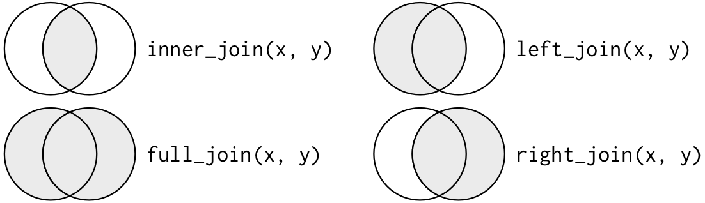

------------------------------------------------------------------------

title: 'AY22-2 SE370: Lesson 20: Keys and Joins'

------------------------------------------------------------------------

```{r setup, include=FALSE}
knitr::opts_chunk$set(echo = TRUE)
library(dplyr)
library(readr)
```

## Relational data

Multiple tables that are interconnected or related, but are stored in separate data files. Understanding the relations between data sets is just as important as understanding individual data.

There are **3 families of verbs** that help you work with relational data:

1\. **Mutating Joins**: Add new variables to one dataframe from matching observations in another

2\. **Filtering Joins**: Filter observations from one data frame based on whether or not they match an observation on the other table

3\. **Set Operations**: Treat observations like they are set elements.

### Keys

Keys are variables used to connect each pair of tables. It is a variable that uniquely identifies an observation. A primary key identifies an observation on its own table. A foreign key identifies an observation on another table.

### Let's explore some joins...

```{r data}

x <- data.frame(key = c(1, 2, 3), val_x = c("x1", "x2", "x3"))
x

y <- data.frame(key = c(1, 2, 4, 2), val_y = c("y1", "y2", "y3", "y4"))
y
```

### Mutating Joins



`inner_join()`: return all rows from x where there are matching values in y, and all columns from x and y. If there are multiple matches between x and y, all combination of the matches are returned. BLUF: Where there is no match, you lose data

```{r inner join}

```

`left_join()`: return all rows from x, and all columns from x and y. Rows in x with no match in y will have NA values in the new columns. If there are multiple matches between x and y, all combinations of the matches are returned. BLUF: Preserves all x rows, even if y columns will be NA

```{r left}

```

`right_join()`: return all rows from y, and all columns from x and y. Rows in y with no match in x will have NA values in the new columns. If there are multiple matches between x and y, all combinations of the matches are returned. BLUF: Preserves all y rows, even if x columns will be NA

```{r right}

```

`full_join()`: return all rows and all columns from both x and y. Where there are not matching values, returns NA for the one missing. BLUF: Perserves all existing data, but may produce a lot of NA values!

```{r full}

```

### Filtering Joins

Filter rows from x based on the presence or absence of matches in y

`semi_join()`: return all rows from x where there are matching values in y, keeping just columns from x. A semi join differs from an inner join because an inner join will return one row of x for each matching row of y, where a semi join will never duplicate rows of x.

```{r anti}

```

`anti_join()`: return all rows from x without a match in y

```{r anti}

```

### Nesting Joins

`nest_join()`: Create a list column of data.frames

```{r nest}


```

## More Practice!

1)  Read in the TRANSCOM data, show the first 6 rows, and explore the data

```{r}

```

2)  Read in the carrier data, show the first 6 rows, and explore the data

```{r}

```

3)  Find the top 5 (known) carriers that sent the most (total) weight to or from AFRICOM. Print the result.

```{r}

```

4)  Use a join to merge the carrier data with your result from the above question. Print the result.

```{r}

```
